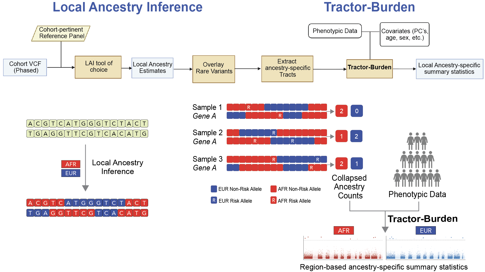

# Tractor-Burden Tutorial

Tractor-Burden is an ancestry-aware rare variant burden testing framework for admixed populations. Similar to the intuition behind [Tractor](https://github.com/Atkinson-Lab/Tractor/tree/master), Tractor-Burden incorporates local ancestry information into rare variant association testing by aggregating ancestry-specific rare variant dosages within user-defined genomic regions and performing ancestry-specific burden tests.

This framework supports:

- Multi-ancestry burden testing
- Ancestry-specific burden models
- Binary or quantitative phenotypes
- Annotation-based variant filtering
- Region-based aggregation using either:
  - annotation `Gene_Name`
  - RVTESTS-style `.set` files
- User-defined genomic intervals 

---

# Workflow Overview





For each ancestry, Tractor-Burden:

1. Loads ancestry-specific dosage and hapcount files
2. Filters variants based on annotation class and MAF thresholds
3. Aggregates rare variant dosages within genomic regions
4. Fits association models:
   - Logistic regression for binary traits
   - Linear regression for quantitative traits
5. Returns ancestry-specific burden statistics

---

# Required Inputs

## 1. Annotation File

Tab-delimited annotation file containing variant information. We recommend annotating variants with VEP prior to running Tractor-Burden and filtering to high- and moderate-impact coding consequences (e.g., missense_variant, frameshift_variant, stop_gained, splice_acceptor_variant, splice_donor_variant, and related SnpEff/VEP consequence terms) using the `--keep-annotations` argument.

### Required Columns

| Column | Description |
|----------|-------------|
| CHROM | Chromosome |
| POS | Position |
| REF | Reference allele |
| ALT | Alternate allele |

### Optional Columns

| Column | Description |
|----------|-------------|
| Gene_Name | Gene assignment used for gene-based aggregation |
| Annotation | Functional annotation specified with `--ann-col` |

### Example

```text
CHROM   POS      REF ALT Gene_Name Annotation
1       12345    A   G   LDLR      missense_variant
1       12500    T   C   LDLR      frameshift_variant
1       13000    G   A   APOB      splice_acceptor_variant
```

## 2. Ancestry-Specific Dosage and Hapcount Files

Tractor-Burden requires ancestry-specific dosage and hapcount files generated from [Tractor extract_tracts.py](https://github.com/Atkinson-Lab/Tractor/blob/master/scripts/extract_tracts.py).

Example:

```text
chr1.anc0.dosage.gz
chr1.anc1.dosage.gz

chr1.anc0.hapcount.gz
chr1.anc1.hapcount.gz
```


Dosage files contain ancestry-specific minor allele dosages for each sample and variant.
Hapcount files contain the number of ancestry-specific haplotypes carried by each sample at each variant.

### Usage

Files should be supplied in matching order:

```bash
--ancestry-names EUR AFR \
--dosage-files chr1.anc0.dosage.gz chr1.anc1.dosage.gz \
--hapcount-files chr1.anc0.hapcount.gz chr1.anc1.hapcount.gz
```
---

## 3. Phenotype File

Tractor-Burden requires a single tab-delimited phenotype file containing sample IDs, the phenotype column, and any covariates to be included in the association model.

### Required Columns

```text
IID
y
```

- `IID` must match the sample IDs in the dosage and hapcount files.
- `y` is the phenotype column.
  - Binary traits should be coded as 0/1.
  - Quantitative traits can take continuous values.
- Tractor-Burden automatically detects whether the phenotype is binary or quantitative based on the values in `y`.

### Example

```text
IID      LDL   age  sex    y      global_ancestry_EUR  global_ancestry_AFR
1456427  105   86   0   -0.25          0.0846               0.9154
1604504   59   21   0   -1.57          0.0907               0.9093
2958502  125   87   0    0.26          0.1306               0.8694
```

### Covariates

Any additional columns may be used as covariates via the `--covariates` argument.

For example:

```bash
--covariates global_ancestry_AFR age sex
```

Common covariates include:

- age
- sex
- global ancestry proportions
- principal components (PCs)
- study-specific covariates
---

# Aggregation Methods

## Option 1: Gene-Based Aggregation

Use the `Gene_Name` column in the annotation file.

Example:

```bash
--gene-col Gene_Name
```

Variants assigned to the same gene will be collapsed into a single burden score.

---

## Option 2: RVTESTS-Style Set File

Use a custom region definition file.

Example 1:

```text
LDLR chr19:11089000-11200000
```
Example 2, for exonic regions only:
```text
LDLR chr19:11089462-11133820,chr19:11089462-11133820,chr19:11089462-11133820,chr19:11089462-11133820,chr19:11089462-11133820
```
Run with:

```bash
--set-file gene_boundaries.set
```

---

## Option 3: Flexible Region-Based Aggregation

Although Tractor-Burden is commonly used for gene-based rare variant aggregation, the framework can aggregate variants across **any user-defined genomic regions**. This enables Tractor-Burden analyses beyond coding variation into noncoding and regulatory regions.

Example:

```text
Region1 chr1:100000-150000
EnhancerA chr2:250000-275000
CustomWindow chr5:1000000-1100000
```

---

# Running Tractor-Burden


Tractor-Burden automatically detects whether the phenotype column `y` is binary or quantitative. Users do **not** need to specify the trait type.


## Example Run

```bash
python tractor_burden_final.py \
  --annotation-file /path/to/annotations.tsv \
  --ann-col consolidated_annotation \
  --set-file /path/to/regions.refFlat.set \
  --ancestry-names EUR AFR \
  --dosage-files \
    /path/to/chr1.anc0.dosage.txt.gz \
    /path/to/chr1.anc1.dosage.txt.gz \
  --hapcount-files \
    /path/to/chr1.anc0.hapcount.txt.gz \
    /path/to/chr1.anc1.hapcount.txt.gz \
  --phenotype-file /path/to/phenotype.tsv \
  --out-tsv /path/to/tractor_burden_results.tsv \
  --keep-annotations \
    missense_variant \
    frameshift_variant \
    splice_acceptor_variant \
    splice_donor_variant \
    stop_gained \
    start_lost \
  --min-mac 1 \
  --maf-scope none \
  --covariates global_ancestry_AFR age sex \
```

---
## Optional Filtering Parameters

We recommend performing standard rare variant QC before running Tractor-Burden to reduce runtime and memory usage.

### Minimum Minor Allele Count


```bash
--min-mac 1
```

Minimum alternate allele count required for a variant to be included in burden testing.

**Default:** `1`

---

### Minor Allele Frequency Filtering


```bash
--maf-scope none
```

Controls how allele frequency filtering is applied.

| Option | Description |
|----------|-------------|
| `none` | No MAF filtering (only `--min-mac` is applied) |
| `ancestry` | Apply MAF filtering separately within each ancestry |
| `total` | Apply MAF filtering using the aggregate allele frequency across all ancestries |

When using `ancestry` or `total`, frequency thresholds can be specified with:

**Defaults:**

```bash
--maf-scope none
--maf-lo 0
--maf-hi 0.01
```

## Output

Tractor-Burden produces ancestry-specific burden association statistics for each tested region.
Example:

```text
chrom  gene      term         estimate      pval        neglog10p  mac  n_carriers  n_variants  m_genes_tested
19     LDLR      burden_AFR   0.411314      3.51e-07    6.45       134  125         59          1256
19     LDLR      burden_EUR  -0.033425      0.8660      0.062      25   25          24          1256
```

### Output Columns

| Column | Description |
|----------|-------------|
| `chrom` | Chromosome containing the tested region |
| `gene` | Name of the tested region or set identifier |
| `term` | Ancestry-specific burden test (`burden_AFR`, `burden_EUR`, etc.) |
| `estimate` | Regression coefficient for the ancestry-specific burden term |
| `pval` | Association p-value |
| `neglog10p` | −log10(p-value) |
| `mac` | Minor allele count aggregated across all qualifying variants in that ancestry |
| `n_carriers` | Number of individuals carrying at least one qualifying variant in that ancestry |
| `n_variants` | Number of variants included in the burden test after annotation and filtering |
| `m_genes_tested` | Total number of tested regions in the analysis (per chromosome) |


The `estimate` corresponds to the effect of a one-unit increase in ancestry-specific burden count. For binary traits, this is the logistic regression coefficient (log-odds scale). For quantitative traits, it represents the linear regression effect estimate.

> **Note:** The `gene` column is a generic region identifier and may correspond to genes, pathways, regulatory elements, sliding windows, or any user-defined set supplied through the region definition file.
---


# Additional Resources

For detailed explanations of phasing, local ancestry painting, and extracting tracts, refer to:

**[Tractor Tutorial](https://github.com/Atkinson-Lab/Tractor-tutorial/tree/main)**

---

# Citation

If you use this pipeline in your research, please cite:

**XYZ (bioRxiv)**


Please direct questions to: pragati.kore@bcm.edu or elizabeth.atkinson@bcm.edu.
